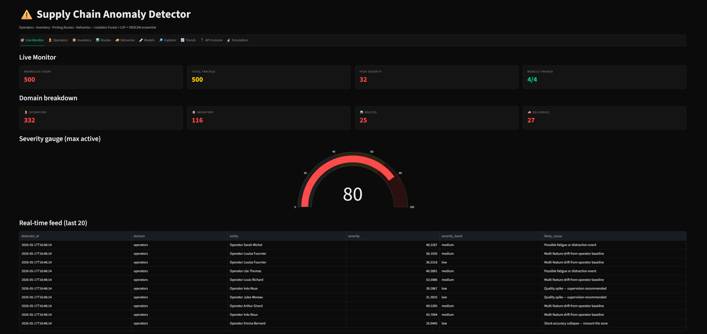

# Supply Chain Anomaly Detector


Real-time anomaly detection across **operators**, **inventory**, **picking routes** and
**supplier deliveries**, powered by an Isolation Forest + LOF + DBSCAN ensemble.

This is **Project 4** of the logistics portfolio:

1. [Warehouse KPI Dashboard](../warehouse-kpi-dashboard) — operational visibility
2. [Picking Route Optimizer](../picking-route-optimizer) — route planning
3. [Demand Forecasting Engine](../demand-forecasting-engine) — predictive demand
4. **Supply Chain Anomaly Detector** ⟵ *this project*

---

## Architecture

```
┌──────────────────────────────────────────────────────────────────┐
│                    Streamlit Dashboard (8501)                    │
│  Live · Ops · Inv · Routes · Deliv · Models · Explorer · Sim     │
└────────────────────────────┬─────────────────────────────────────┘
                             │ HTTP (requests)
                             ▼
┌──────────────────────────────────────────────────────────────────┐
│                       FastAPI REST API (8000)                    │
│  /api/v1/{status, train, detect/*, anomalies/*, stream/tick}     │
└────────────────────────────┬─────────────────────────────────────┘
                             ▼
┌──────────────────────────────────────────────────────────────────┐
│                   Detection Engine (in-memory)                   │
│  4 domains × Ensemble = (Isolation Forest + LOF + DBSCAN)        │
│  Pattern-based Explainer · Severity scorer · History buffer      │
└──────────────────────────────────────────────────────────────────┘
```

---

## Features

- **4 anomaly domains** — operators, inventory, routes, deliveries
- **Ensemble detection** — 2-of-3 model agreement → anomaly
- **Severity 0–100** — weighted average (IF 0.4, LOF 0.4, DBSCAN 0.2)
- **Human-readable explanations** — z-score context + likely-cause patterns
- **Real-time stream** — `/stream/tick` simulates and scores a single record
- **Streamlit dashboard** — 10 tabs, dark theme, Plotly visualisations
- **REST API** — FastAPI + auto-generated Swagger UI
- **History buffer** — last 500 anomalies retained in memory
- **Live API console** — call any endpoint directly from the dashboard
- **Model metrics** — precision / recall / F1 / ROC-AUC on labeled training set

---

## API

Base URL: `http://localhost:8000`

| Method | Path                              | Description                                          |
|--------|-----------------------------------|------------------------------------------------------|
| GET    | `/`                               | Health check                                         |
| GET    | `/api/v1/status`                  | Models trained, history size                         |
| POST   | `/api/v1/train`                   | Retrain (body: `{"domain":"all"}`)                  |
| POST   | `/api/v1/detect/operators`        | Detect operator anomalies                            |
| POST   | `/api/v1/detect/inventory`        | Detect inventory anomalies                           |
| POST   | `/api/v1/detect/routes`           | Detect picking-route anomalies                       |
| POST   | `/api/v1/detect/deliveries`       | Detect delivery anomalies                            |
| POST   | `/api/v1/detect/all`              | Cross-domain detection on a warehouse snapshot       |
| POST   | `/api/v1/stream/tick`             | Simulate + score one record                          |
| GET    | `/api/v1/anomalies/history`       | Last 500 anomalies (filterable)                      |
| GET    | `/api/v1/anomalies/stats`         | Counts by domain + severity distribution             |
| GET    | `/api/v1/models/{domain}`         | Model metrics + feature importance                   |
| GET    | `/docs`                           | Swagger UI                                           |

---

## Screenshots



---

## Installation

```bash
git clone <repo-url>
cd anomaly-detector
python -m venv .venv
.venv\Scripts\activate              # Windows
# source .venv/bin/activate         # Linux/macOS
pip install -r requirements.txt
```

### Launch (one command)

```bash
python start.py
```

- API:       http://localhost:8000/docs
- Dashboard: http://localhost:8501

### Run separately

```bash
uvicorn api.main:app --reload --port 8000
streamlit run dashboard/app.py --server.port 8501
```

---

## Project structure

```
anomaly-detector/
├── api/              # FastAPI app + per-domain routers
├── core/             # IF, LOF, DBSCAN, ensemble, explainer, scorer, trainer
├── data/             # Catalog, operators, synthetic generator
├── dashboard/        # Streamlit app (10 tabs)
├── assets/           # Dark-theme CSS
├── start.py          # Launches API + Dashboard
└── requirements.txt
```

---

## Author

**Iyad Belkadi** — supply-chain & data engineering portfolio
